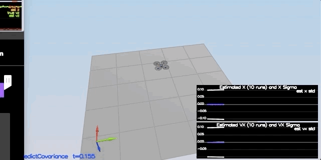

# Flying Car Estimation Project #

Welcome to the flying car estimation project.  In this project, we will be developing the estimation portion of the controller used in the CPP simulator.  By the end of the project, our simulated quad will be flying with our estimator and our custom controller (from the flying car controller project)!


## The Tasks ##

Once again, WE will be building up our estimator in pieces.  At each step, there will be a set of success criteria that will be displayed both in the plots and in the terminal output to help us along the way.

Project outline:

 - [Step 1: Sensor Noise](#step-1-sensor-noise)
 - [Step 2: Attitude Estimation](#step-2-attitude-estimation)
 - [Step 3: Prediction Step](#step-3-prediction-step)
 - [Step 4: Magnetometer Update](#step-4-magnetometer-update)
 - [Step 5: Closed Loop + GPS Update](#step-5-closed-loop--gps-update)
 - [Step 6: Adding Our Controller](#step-6-adding-our-controller)


### Step 1: Sensor Noise ###

For the controls project, the simulator was working with a perfect set of sensors, meaning none of the sensors had any noise.  The first step to adding additional realism to the problem, and developing an estimator, is adding noise to the quad's sensors.  For the first step, we will collect some simulated noisy sensor data and estimate the standard deviation of the quad's sensor.

1. Let's run the simulator in the same way as we have before

2. We will choose scenario `06_NoisySensors`.  In this simulation, the interest is to record some sensor data on a static quad, so we will not see the quad move.  We will see two plots at the bottom, one for GPS X position and one for The accelerometer's x measurement.  The dashed lines are a visualization of a single standard deviation from 0 for each signal. The standard deviations are initially set to arbitrary values (after processing the data in the next step, we will be adjusting these values).  If they were set correctly, we should see ~68% of the measurement points fall into the +/- 1 sigma bound.  When we run this scenario, the graphs we see will be recorded to the following csv files with headers: `config/log/Graph1.txt` (GPS X data) and `config/log/Graph2.txt` (Accelerometer X data).

3. We will process the logged files to figure out the standard deviation of the the GPS X signal and the IMU Accelerometer X signal. It is done in the sensor_noise_stddev.xsls file. 

4. No, we will plug in our result into the top of `config/6_Sensornoise.txt`.  Specially, set the values for `MeasuredStdDev_GPSPosXY` and `MeasuredStdDev_AccelXY` to be the values we have calculated. The values are:

```
MeasuredStdDev_GPSPosXY = 0.7174806846
MeasuredStdDev_AccelXY = 0.5125994827
```

5. We will run the simulator. If our values are correct, the dashed lines in the simulation will eventually turn green, indicating we’re capturing approx 68% of the respective measurements (which is what we expect within +/- 1 sigma bound for a Gaussian noise model)

<p align="center">

</p>

### Step 2: Attitude Estimation ###

Now let's look at the first step to our state estimation: including information from our IMU.  In this step, we will be improving the complementary filter-type attitude filter with a better rate gyro attitude integration scheme.

1. Let's run scenario `07_AttitudeEstimation`.  For this simulation, the only sensor used is the IMU and noise levels are set to 0 (see `config/07_AttitudeEstimation.txt` for all the settings for this simulation).  There are two plots visible in this simulation.
   - The top graph is showing errors in each of the estimated Euler angles.
   - The bottom shows the true Euler angles and the estimates.
Observe that there’s quite a bit of error in attitude estimation.

2. In `QuadEstimatorEKF.cpp`, we can see the function `UpdateFromIMU()` contains a complementary filter-type attitude filter.  To reduce the errors in the estimated attitude (Euler Angles), we will implement a better rate gyro attitude integration scheme.  We should be able to reduce the attitude errors to get within 0.1 rad for each of the Euler angles, as shown in the screenshot below.


In the screenshot above the attitude estimation using linear scheme (left) and using the improved nonlinear scheme (right). Note that Y axis on error is much greater on left.

***Success criteria:*** *Our attitude estimator needs to get within 0.1 rad for each of the Euler angles for at least 3 seconds.*

Line 96-104, updated the function `UpdateFromIMU()`

```
  Quaternion<float> qt_attitude = Quaternion<float>::FromEuler123_RPY(rollEst, pitchEst, ekfState(6));
  qt_attitude.IntegrateBodyRate(gyro, dtIMU);
  float predictedPitch = qt_attitude.Pitch();
  float predictedRoll = qt_attitude.Roll();
  ekfState(6) = qt_attitude.Yaw();	// yaw

  // normalize yaw to -pi .. pi
  if (ekfState(6) > F_PI) ekfState(6) -= 2.f*F_PI;
  if (ekfState(6) < -F_PI) ekfState(6) += 2.f*F_PI;
```
Here is the output:

<p align="center">

</p>

### Step 3: Prediction Step ###

In this next step we will be implementing the prediction step of our filter.


1. We will run scenario `08_PredictState`.  This scenario is configured to use a perfect IMU (only an IMU). Due to the sensitivity of double-integration to attitude errors, we've made the accelerometer update very insignificant (`QuadEstimatorEKF.attitudeTau = 100`).  The plots on this simulation show element of our estimated state and that of the true state.  At the moment we should see that our estimated state does not follow the true state.

2. In `QuadEstimatorEKF.cpp`, we implement the state prediction step in the `PredictState()` functon. If we do it correctly, when we run scenario `08_PredictState` we should see the estimator state track the actual state.

Line 166-173, updated the function `PredictState()`

```
  predictedState(0) = predictedState(0) + curState(3) * dt;
  predictedState(1) = predictedState(1) + curState(4) * dt;
  predictedState(2) = predictedState(2) + curState(5) * dt;
    
  V3F acc_inertial = attitude.Rotate_BtoI(accel);
  predictedState(0) = curState(3) + acc_inertial.x * dt;
  predictedState(1) = curState(4) + acc_inertial.y * dt;
  predictedState(2) = curState(5) + acc_inertial.z * dt -CONST_GRAVITY * dt;
```

Here is the output:
<p align="center">

</p>

3. Now let's introduce a realistic IMU, one with noise.  Run scenario `09_PredictionCov`. We will see a small fleet of quadcopter all using our prediction code to integrate forward. We will see two plots:
   - The top graph shows 10 (prediction-only) position X estimates
   - The bottom graph shows 10 (prediction-only) velocity estimates
We will notice however that the estimated covariance (white bounds) currently do not capture the growing errors.

4. In `QuadEstimatorEKF.cpp`, let's calculate the partial derivative of the body-to-global rotation matrix in the function `GetRbgPrime()`.  

Line 200-213, updated the function `GetRbgPrime()`

```
  float s_roll = sin(roll);
  float s_pitch = sin(pitch);
  float s_yaw = sin(yaw);
  float c_roll = cos(roll);
  float c_pitch = cos(pitch);
  float c_yaw = cos(yaw);
  
  RbgPrime(0,0) = -c_pitch * s_yaw;
  RbgPrime(0,1) = -s_roll * s_pitch * s_yaw - c_pitch * c_yaw;
  RbgPrime(0,2) = -c_roll  * s_pitch * s_yaw + s_roll   * c_yaw;
  
  RbgPrime(1,0) = c_pitch * c_yaw;
  RbgPrime(1,1) = s_roll * s_pitch * c_yaw - c_roll * s_yaw;
  RbgPrime(1,2) = c_roll  * s_pitch * c_yaw + s_roll   * s_yaw;
```

Now we have that function implemented, let's implement the rest of the prediction step (predict the state covariance forward) in `Predict()` Line 259-267.

```
  gPrime(0,3) = dt;
  gPrime(1,4) = dt;
  gPrime(2,5) = dt;
  
  gPrime(3,6) = (RbgPrime(0)*accel).sum()*dt;
  gPrime(4,6) = (RbgPrime(1)*accel).sum()*dt;
  gPrime(5,6) = (RbgPrime(2)*accel).sum()*dt;
  
  ekfCov = gPrime * ekfCov *gPrime.transpose() + Q;

```

<p align="center">

</p>


### Step 4: Magnetometer Update ###

Up until now we've only used the accelerometer and gyro for our state estimation.  In this step, we will be adding the information from the magnetometer to improve our filter's performance in estimating the vehicle's heading.

1. Run scenario `10_MagUpdate`.  This scenario uses a realistic IMU, but the magnetometer update hasn’t been implemented yet. As a result, we will notice that the estimate yaw is drifting away from the real value (and the estimated standard deviation is also increasing).  Note that in this case the plot is showing us the estimated yaw error (`quad.est.e.yaw`), which is drifting away from zero as the simulation runs.  We should also see the estimated standard deviation of that state (white boundary) is also increasing.

2. Tuned the parameter `QYawStd = 0.075` (`QuadEstimatorEKF.txt`) for the QuadEstimatorEKF so that it approximately captures the magnitude of the drift.

3. Let's implement magnetometer update in the function `UpdateFromMag()` Line 321-326.  

```
    float diff = z(0) - ekfState(6);
    if (diff > F_PI) z(0) -= 2.f*F_PI;
    if (diff < -F_PI) z(0)+= 2.f*F_PI;
    
    hPrime(0,6)= 1.f;
    zFromX(0)=ekfState(6);
```

Once completed, we can see:

<p align="center">

</p>


### Step 5: Closed Loop + GPS Update ###

Here, is the modified code for `UpdateFromGPS()`, Line 287-297:

```
  // GPS UPDATE
  // Hints: 
  //  - The GPS measurement covariance is available in member variable R_GPS
  //  - this is a very simple update
  ////////////////////////////////////////////////////////
  
  for(int i =0; i<6;i++)
  {
      zFromX(i) = ekfState(i);
      hPrime(i,i) = 1.f;
  }
  
```

Here is the output:
<p align="center">

</p>

### Step 6: Adding Our Controller ###

Up to this point, we have been working with a controller that has been relaxed to work with an estimated state instead of a real state.  So now, we will see how well our controller performs and de-tune our controller accordingly.

1. Let's replace `QuadController.cpp` with the controller we wrote in the last project.

2. Let's also replace `QuadControlParams.txt` with the control parameters we came up with in the last project.

Here is the output:
<p align="center">

</p>

3. Our controller crashed. Flying from an estimated state (even with ideal sensors) is very different from flying with ideal pose. We may need to de-tune our controller. Here are the results after de-tuning:

<p align="center">

</p>


## Authors ##

Thanks to Fotokite for the initial development of the project code and simulator.
